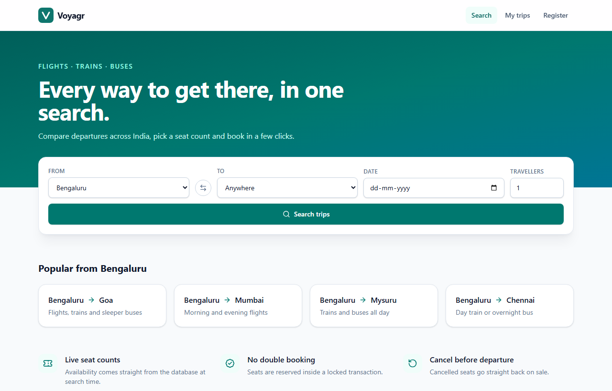
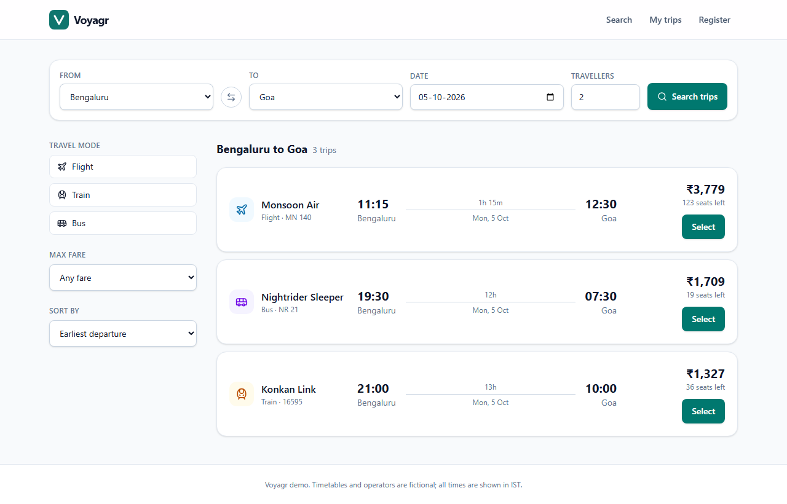
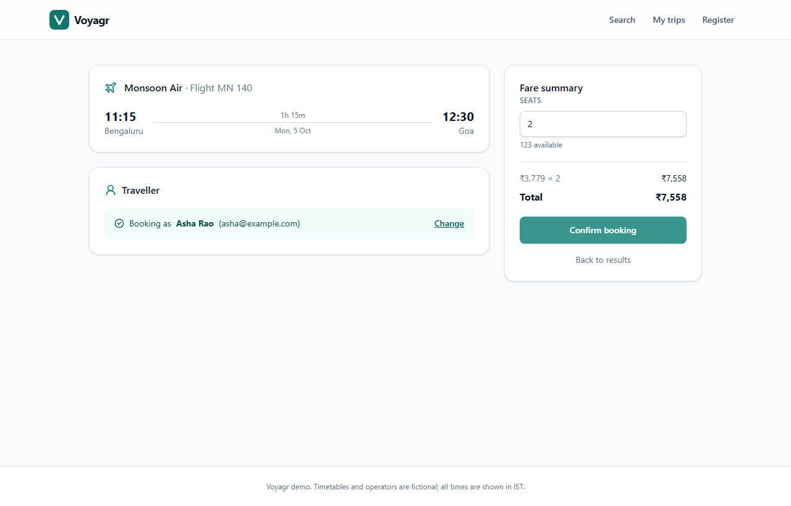
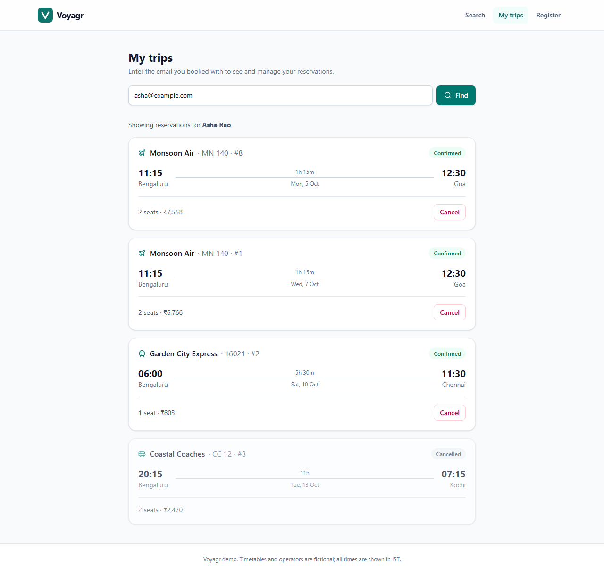
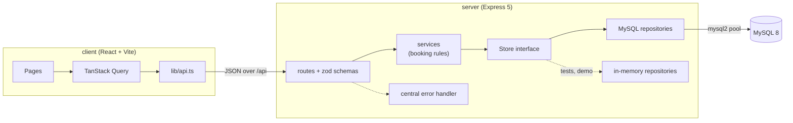
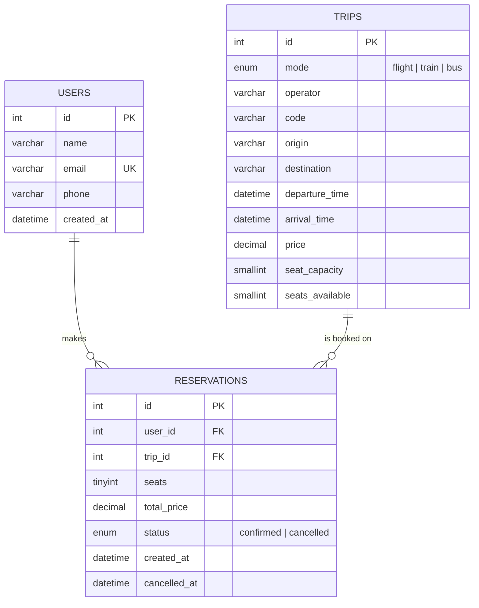

# Voyagr

**[▶ Live demo](https://raja9964.github.io/Voyagr/)**

Search and book flights, trains and buses across India, with seat inventory that can't be oversold.

[](https://github.com/Raja9964/Voyagr/actions/workflows/ci.yml)

The live demo runs entirely in your browser with sample data, using the server's own booking logic. The full app runs on Express and MySQL.

| Search | Results |
| --- | --- |
|  |  |
| **Booking** | **My trips** |
|  |  |

## Features

- Trip search by origin, destination, date and number of travellers, with filters for travel mode and maximum fare and sorting by departure, fare or journey time
- Booking flow that looks a traveller up by email and creates a profile inline if they are new
- Seat booking inside a MySQL transaction with `SELECT ... FOR UPDATE`, so concurrent requests can't oversell a trip
- Fare captured at booking time (`total_price`) so later price changes don't rewrite past bookings
- "My trips" page that lists a traveller's reservations and cancels them before departure, returning the seats to inventory
- Simple traveller registration
- Request validation with zod and consistent JSON errors (400 / 404 / 409)
- Seed data built with a recursive CTE: a fictional daily timetable expanded over the next 14 days
- A live demo on GitHub Pages that runs the same services and validation in the browser, with no backend to host (see [How the live demo works](#how-the-live-demo-works))

Scope note: there is no authentication. A traveller is identified by email only, which keeps the demo simple but means anyone who knows a reservation id can cancel it.

## Tech stack

| Layer | Tools |
| --- | --- |
| Client | React 19, TypeScript, Vite, Tailwind CSS v4, TanStack Query, React Router |
| Server | Node.js 24 (native TypeScript), Express 5, mysql2 (promise pool), zod, helmet, cors |
| Database | MySQL 8 |
| Testing | Vitest, Supertest, real-MySQL integration tests |
| CI | GitHub Actions with a MySQL 8 service container; a Pages workflow deploys the demo |

## Architecture



Routes parse and validate input, services hold the business rules (seat checks, departure checks, cancellation), and repositories own SQL. Services depend on a `Store` interface with a `transaction()` method, so the same booking code runs against MySQL in production and an in-memory store in route tests and the live demo.

### How the live demo works

The GitHub Pages build sets `VITE_DEMO=true`. `lib/api.ts` then hands each `/api` request to `client/src/demo/backend.ts` instead of the network. That file routes the request to the server's own services, zod schemas and in-memory store, imported through a Vite alias, so status codes, validation messages and booking rules match the real API.

- **Seed data:** a port of `seed.sql` (same timetable, operators, fares and sample bookings), generated relative to today so there are always upcoming trips. Tests check it against values MySQL produces from `seed.sql`.
- **Persistence:** travellers and reservations are saved in the browser's localStorage. Nothing you type is sent to a server. **Reset data** in the demo banner restores the sample data.
- **Routing:** the demo build uses hash routes (`#/trips?...`), so deep links and page refreshes work on static hosting.

## Data model



All `DATETIME` columns hold UTC. The schema backs up the application rules with constraints: `seats_available` is unsigned and must not exceed `seat_capacity`, arrival must be after departure, and `cancelled_at` is set exactly when a reservation is cancelled.

## Project structure

```
.
├── client/                 React app
│   └── src/
│       ├── components/     layout, search form, trip card, UI states
│       ├── demo/           in-browser API, seed and storage for the live demo
│       ├── lib/            API client, types, formatting
│       └── pages/          home, results, booking, confirmation, my trips, register
├── server/
│   ├── db/                 schema.sql, seed.sql
│   ├── scripts/db-init.ts  creates the database and loads schema + seed
│   ├── src/
│   │   ├── domain/         shared types
│   │   ├── http/           routes, zod schemas, error handler
│   │   ├── services/       users, trips, reservations
│   │   ├── repositories/   Store interface, mysql/ and memory/ implementations
│   │   ├── app.ts          builds the Express app from a Store
│   │   └── index.ts        wires config, pool and server
│   └── test/               API tests (in-memory) and MySQL integration tests
└── .github/workflows/      ci.yml (tests), pages.yml (live demo deploy)
```

## Run it locally

Requirements: Node.js 22.18+ (24 recommended, the server runs TypeScript natively) and MySQL 8.0.16+.

**1. Create a database and user** (in the MySQL shell, as an admin):

```sql
CREATE DATABASE voyagr CHARACTER SET utf8mb4 COLLATE utf8mb4_0900_ai_ci;
CREATE USER 'voyagr'@'%' IDENTIFIED BY 'choose-a-password';
GRANT ALL PRIVILEGES ON voyagr.* TO 'voyagr'@'%';
```

**2. Start the API** (it listens on port 8102):

```bash
cd server
cp .env.example .env        # then set DB_PASSWORD
npm install
npm run db:init             # drops and recreates tables, loads demo data
npm run dev
```

**3. Start the client** (Vite serves it on port 5102):

```bash
cd client
npm install
npm run dev
```

The Vite dev server proxies `/api` to the API on port 8102, so no CORS setup is needed. Demo travellers: `asha@example.com` and `vikram@example.com`.

To try the client without the API or MySQL, start it in demo mode instead:

```bash
cd client
VITE_DEMO=true npm run dev
```

## Configuration

Server (`server/.env`):

| Variable | Default | Description |
| --- | --- | --- |
| `PORT` | `8102` | API port |
| `CLIENT_ORIGIN` | the Vite dev server (port 5102) | Comma-separated origins allowed by CORS |
| `DB_HOST` | this machine | MySQL host |
| `DB_PORT` | `3306` | MySQL port |
| `DB_USER` | `voyagr` | MySQL user |
| `DB_PASSWORD` | empty | MySQL password |
| `DB_NAME` | `voyagr` | Database name |
| `DB_POOL_SIZE` | `10` | Connection pool size |
| `TEST_DB_NAME` | `voyagr_test` | Database used (and wiped) by integration tests |

Client (`client/.env`):

| Variable | Default | Description |
| --- | --- | --- |
| `VITE_API_URL` | empty | API origin for production builds. Leave empty in development to use the Vite proxy. |
| `VITE_DEMO` | empty | Set to `true` to run the in-browser demo API instead of calling the server |

## API reference

All endpoints are under `/api`. Errors use the shape `{ "error": { "code", "message", "details?" } }`.

| Method | Path | Description | Responses |
| --- | --- | --- | --- |
| GET | `/health` | Liveness and database check | 200, 503 |
| GET | `/cities` | Distinct origin and destination cities | 200 |
| GET | `/trips` | Search upcoming trips. Query: `from`, `to`, `date` (YYYY-MM-DD, IST), `mode` (`flight,train,bus`), `maxPrice`, `seats`, `sort` (`departure`, `price`, `duration`), `limit` | 200, 400 |
| GET | `/trips/:id` | Trip details | 200, 404 |
| POST | `/users` | Register `{ name, email, phone? }` and return the new user with its id | 201, 400, 409 |
| GET | `/users/lookup?email=` | Find a traveller by email | 200, 404 |
| GET | `/users/:id/reservations` | A traveller's reservations with trip details | 200, 404 |
| POST | `/reservations` | Book `{ userId, tripId, seats }` (1 to 9 seats) | 201, 400, 404, 409 |
| GET | `/reservations/:id` | Reservation with trip details | 200, 404 |
| POST | `/reservations/:id/cancel` | Cancel before departure and release the seats | 200, 404, 409 |

### How booking stays consistent

```
BEGIN
  SELECT ... FROM trips WHERE id = ? FOR UPDATE   -- other bookings for this trip wait here
  check departure time and seats_available
  UPDATE trips SET seats_available = seats_available - ?
  INSERT INTO reservations (..., total_price)
COMMIT                                             -- or ROLLBACK on any error
```

Cancellation locks the reservation, then the trip, marks it cancelled and adds the seats back in the same transaction.

## Testing

```bash
cd server
npm test                    # API tests against the in-memory store
npm run typecheck
npm run lint
```

The MySQL integration tests run when `DB_HOST` is set. Point them at a MySQL 8 server; they create and wipe their own database (`TEST_DB_NAME`, default `voyagr_test`):

```bash
DB_HOST=your-mysql-host DB_PORT=3306 DB_USER=root DB_PASSWORD=secret npm test
```

The integration suite checks SQL filtering, the unique email constraint, rollback on failure, schema constraints, and fires 12 concurrent booking requests at a trip with 5 seats to confirm exactly 5 succeed.

```bash
cd client
npm test                    # formatting helpers and the demo backend
npm run lint
npm run build
```

CI runs all of the above on every push and pull request, with MySQL 8 as a service container. The Pages workflow builds the demo (`VITE_DEMO=true`) and deploys it to GitHub Pages on every push to `main`.

## License

[MIT](LICENSE)
